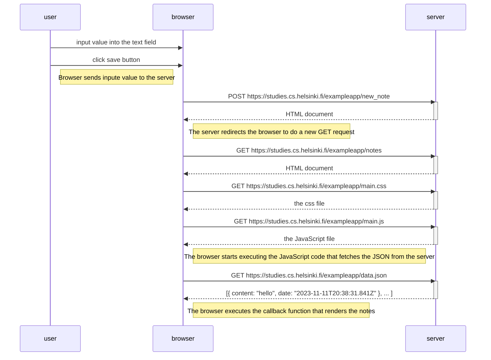

```mermaid
sequenceDiagram
    participant user
    participant browser
    participant server

    user->>browser: input value into the text field
    user->>browser: click save button

    note right of user: Browser sends inpute value to the server 

    browser->>server: POST https://studies.cs.helsinki.fi/exampleapp/new_note
    activate server
    server-->>browser: HTML document
    deactivate server

    NOTE right OF browser: The server redirects the browser to do a new GET request 

    browser->>server: GET https://studies.cs.helsinki.fi/exampleapp/notes
    activate server
    server-->>browser: HTML document
    deactivate server

    browser->>server: GET https://studies.cs.helsinki.fi/exampleapp/main.css
    activate server
    server-->>browser: the css file
    deactivate server

    browser->>server: GET https://studies.cs.helsinki.fi/exampleapp/main.js
    activate server
    server-->>browser: the JavaScript file
    deactivate server

    Note right of browser: The browser starts executing the JavaScript code that fetches the JSON from the server

    browser->>server: GET https://studies.cs.helsinki.fi/exampleapp/data.json
    activate server
    server-->>browser: [{ content: "hello", date: "2023-11-11T20:38:31.841Z" }, ... ]
    deactivate server

    Note right of browser: The browser executes the callback function that renders the notes
```